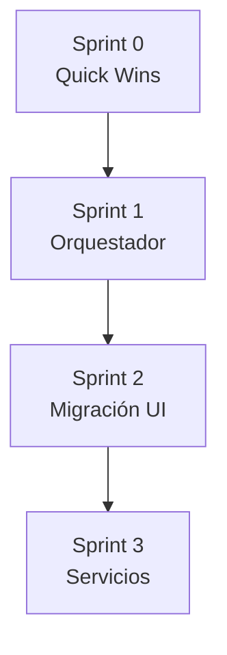

# Plan de Mejoras del Módulo de Conteo

**Basado en:** Análisis técnico externo (17 julio 2026)
**Estado:** Planificado
**Versión:** 1.0

---

## 📋 RESUMEN EJECUTIVO

El análisis identificó **4 riesgos críticos** y **4 riesgos medios** en el módulo de conteo:

| Riesgo                           | Severidad  | Estado                   |
| -------------------------------- | ---------- | ------------------------ |
| God hooks en useCountingLogic    | 🔴 Crítico | Confirmado (405 LOC)     |
| Doble sistema de UI              | 🔴 Crítico | Confirmado (22 archivos) |
| Mode-switching frágil            | 🔴 Crítico | Por verificar            |
| Race conditions autosave         | 🔴 Crítico | Por verificar            |
| useCountingSync silencia errores | 🟠 Medio   | Por verificar            |
| Servicios fragmentados           | 🟠 Medio   | Por verificar            |
| confirm() nativo                 | 🟠 Medio   | Por verificar            |
| useCountingAI sin gating         | 🟠 Medio   | Por verificar            |

---

## 🎯 PLAN DE ACCIÓN

### SPRINT 0 — Quick Wins (1 semana)

```
┌─────────────────────────────────────────────────────────┐
│ SPRINT 0: Quick Wins                                    │
├─────────────────────────────────────────────────────────┤
│ [ ] 1. Tipar sessionId con parser explícito           │
│ [ ] 2. Testear countingDomain.ts                        │
│ [ ] 3. Capturar todos los errores en useCountingSync   │
│ [ ] 4. Reemplazar confirm() por modal reutilizable      │
│ [ ] 5. Auditar useCountingAI con/sin API key          │
└─────────────────────────────────────────────────────────┘
```

#### 1. Tipar sessionId con parser explícito

**Problema actual:**

```typescript
const isBlindMode = sessionId => sessionId.startsWith('HM-');
```

**Solución:**

```typescript
// src/features/counting/domain/countingTypes.ts
export interface SessionId {
  readonly raw: string;
  readonly mode: 'blind' | 'theoretical';
  readonly prefix: string;
}

export function parseSessionId(id: string): SessionId {
  if (id.startsWith('HM-')) {
    return { raw: id, mode: 'blind', prefix: 'HM-' };
  }
  return { raw: id, mode: 'theoretical', prefix: '' };
}

export function isBlindSession(sessionId: string | SessionId): boolean {
  if (typeof sessionId === 'object') {
    return sessionId.mode === 'blind';
  }
  return sessionId.startsWith('HM-');
}
```

#### 2. Testear countingDomain.ts

**Funciones puras a testear:**

- `isPharmaBarcode(barcode: string): boolean`
- `evaluateProduct(barcode, session): EvaluationResult`
- `calculateCountingMetrics(scans): Metrics`
- `isValidExpiryDate(expiry): boolean`
- `calculateDiscrepancy(expected, actual): Discrepancy`

#### 3. Capturar todos los errores en useCountingSync

**Problema actual:**

```typescript
// Solo captura 406
if (error.status === 406) { ... }
```

**Solución:** Capturar todos los errores y emitir a canal de sync health.

#### 4. Reemplazar confirm() por modal

**Problema actual:**

```typescript
const reset = () => {
  if (confirm('¿Vaciar todo el contenido de este bulto?')) {
    // ...
  }
};
```

**Solución:** Usar un `ConfirmModal` reutilizable.

---

### SPRINT 1 — Estabilizar el Orquestador (2 semanas)

```
┌─────────────────────────────────────────────────────────┐
│ SPRINT 1: Estabilizar Orquestador                        │
├─────────────────────────────────────────────────────────┤
│ [ ] 1. Partir useCountingLogic en hooks cohesivos       │
│       - useCountingScanner (state machine)              │
│       - useCountingAutosave (persistencia)             │
│       - useCountingActions (comandos)                   │
│       - useCountingSession (gestión de sesión)         │
│ [ ] 2. Introducir CountingFacade                       │
│ [ ] 3. Sincronizar itemsRef con state                  │
│ [ ] 4. Tests de integración                           │
└─────────────────────────────────────────────────────────┘
```

#### Hooks propuestos

```typescript
// useCountingScanner - State machine
export function useCountingScanner() {
  // Estados: IDLE, LOOKING_UP, COMMITTING, MANUAL_ENTRY, AWAITING_PHARMA
  // Acciones: startScan, commitScan, cancelScan, etc.
}

// useCountingAutosave - Persistencia
export function useCountingAutosave() {
  // Auto-save cada 30s
  // Recovery al volver
  // Sync con itemsRef
}

// useCountingActions - Comandos
export function useCountingActions() {
  // undoLastScan
  // toggleAutoLock
  // applyPotentialMatch
  // pharmaCompletion
}

// useCountingSession - Gestión
export function useCountingSession() {
  // Inicio/fin de sesión
  // Multiplicador
  // Location
  // beforeunload
}
```

---

### SPRINT 2 — Cerrar Migración UI (2 semanas)

```
┌─────────────────────────────────────────────────────────┐
│ SPRINT 2: Cerrar Migración UI                          │
├─────────────────────────────────────────────────────────┤
│ [ ] 1. Inventario de componentes v1 vs v2               │
│ [ ] 2. Decidir: ¿v1 muere o v2 muere?                  │
│ [ ] 3. Plan de migración por componente                │
│ [ ] 4. Ejecutar migración                              │
│ [ ] 5. Borrar la rama perdedora                        │
└─────────────────────────────────────────────────────────┘
```

#### Inventario actual

| Componente              | v1  | v2  | Recomendación  |
| ----------------------- | --- | --- | -------------- |
| CountingCameraView      | ✅  | ❌  | v2 necesita    |
| CountingKanbanView      | ✅  | ❌  | v2 necesita    |
| ProductivityDashboard   | ✅  | ✅  | Unificar en v2 |
| StartCountingModal      | ✅  | ❌  | v2 necesita    |
| TheoreticalLoadSelector | ✅  | ❌  | v2 necesita    |
| CycleCountPanel         | ❌  | ✅  | Mantener v2    |
| CountingHistory         | ❌  | ✅  | Mantener v2    |
| DiscrepancyReport       | ❌  | ✅  | Mantener v2    |

**Recomendación:** Mantener v2 como fuente de verdad, migrar v1 restantes a v2, eliminar v1.

---

### SPRINT 3 — Robustecer Servicios (1-2 semanas)

```
┌─────────────────────────────────────────────────────────┐
│ SPRINT 3: Robustecer Servicios                          │
├─────────────────────────────────────────────────────────┤
│ [ ] 1. Registrar servicios en DI Container              │
│ [ ] 2. Tests unitarios:                                │
│       - CycleCountService                              │
│       - DiscrepancyAlertService                       │
│       - RFIDService                                    │
│       - VoiceCommandService                            │
│ [ ] 3. Documentar contratos (interfaces públicas)     │
└─────────────────────────────────────────────────────────┘
```

---

## 📊 MÉTRICAS DE ÉXITO

| Sprint   | Objetivo            | Métrica                    |
| -------- | ------------------- | -------------------------- |
| Sprint 0 | Quick wins          | 5/5 tareas completadas     |
| Sprint 1 | Orquestador estable | useCountingLogic < 100 LOC |
| Sprint 2 | Un solo sistema UI  | 0 componentes duplicados   |
| Sprint 3 | Servicios testeados | 80% cobertura              |

---

## 🔗 DEPENDENCIAS



---

## 📅 CRONOGRAMA SUGERIDO

```
Semana 1-2: Sprint 0 (Quick Wins)
Semana 3-4: Sprint 1 (Orquestador)
Semana 5-6: Sprint 1 (cont.) + Sprint 2 (inicio)
Semana 7-8: Sprint 2 (Migración UI)
Semana 9-10: Sprint 3 (Servicios)
```

---

## ✅ CHECKLIST DE VERIFICACIÓN

### Antes de empezar

- [ ] Revisar y aprobar este plan
- [ ] Asignar recursos
- [ ] Definir Definition of Done

### Después de cada sprint

- [ ] Code review completo
- [ ] Tests pasando
- [ ] TypeScript sin errores
- [ ] Demo al equipo
- [ ] Documentar lecciones aprendidas
