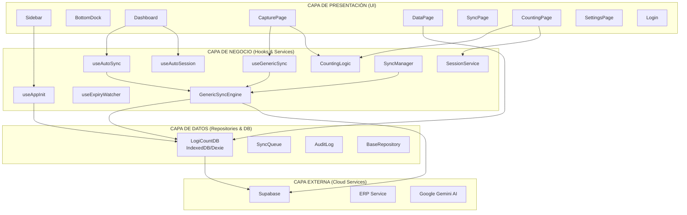
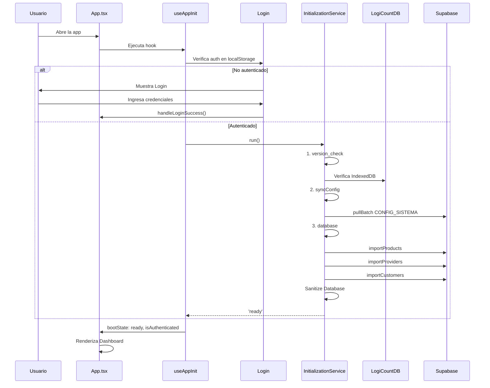
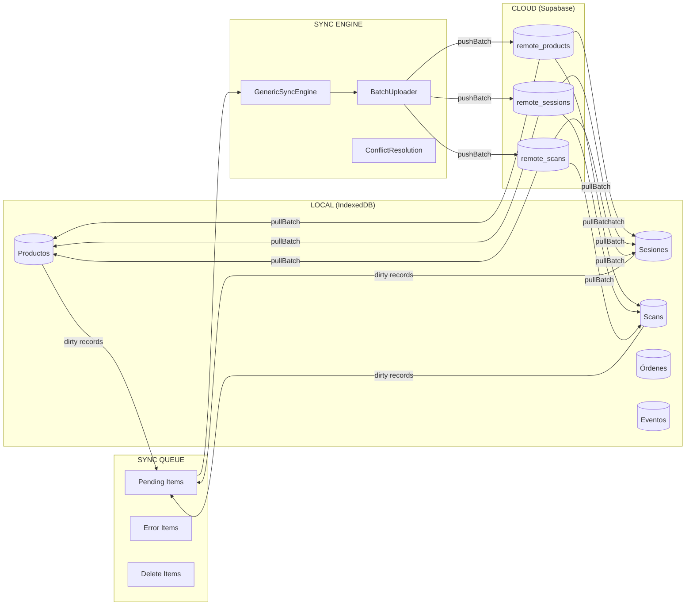
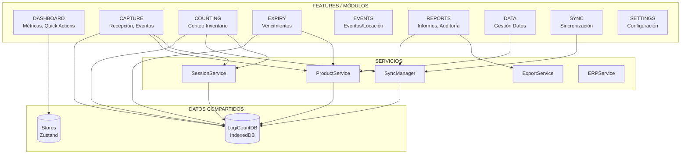
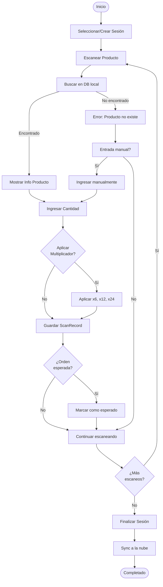
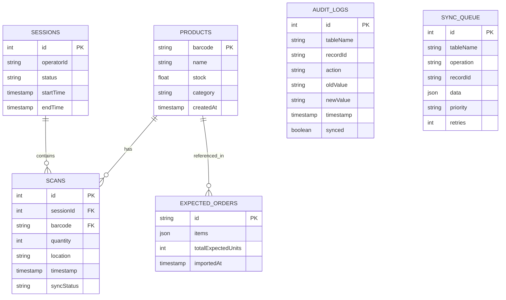
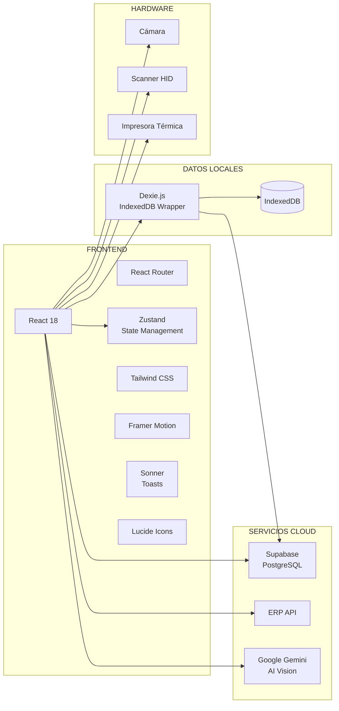
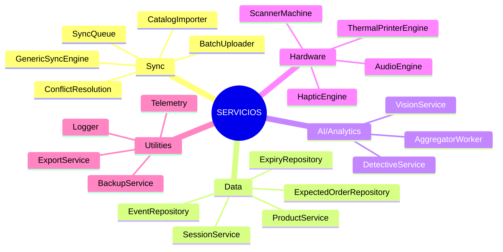
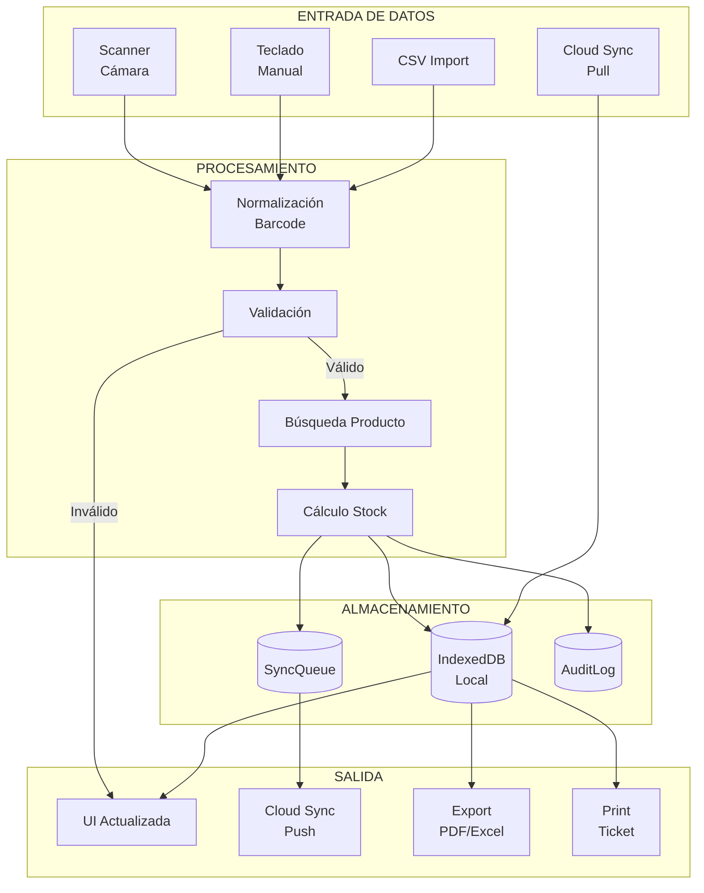

# Diagrama de Arquitectura - LogiCount Pro

## 1. Arquitectura General (Capas)

## 2. Flujo de Inicialización de la App

## 3. Flujo de Sincronización (Sync Architecture)

## 4. Módulos de Negocio

## 5. Flujo de Conteo de Inventario (Counting Flow)

## 6. Arquitectura de Base de Datos Local

## 7. Stack Tecnológico

## 8. Servicios Clave

## 9. Resumen de Flujo de Datos

---

## Notas de Implementación

### Lazy Loading
- Todos los módulos se cargan con `lazyWithRetry()` para optimizar el bundle inicial
- El Dashboard carga primero, otros módulos se cargan bajo demanda

### Offline-First
1. Todas las operaciones escriben primero en IndexedDB
2. Los cambios pendientes van a SyncQueue
3. useAutoSync periódicamente sube los cambios a la nube
4. En caso de conflicto, ConflictResolution aplica estrategias configuradas

### Hooks Globales
- `useAutoSync()` - Sincronización automática cada 60s
- `useAutoSession()` - Gestión automática de sesiones
- `useExpiryWatcher()` - Monitoreo de productos próximos a vencer
