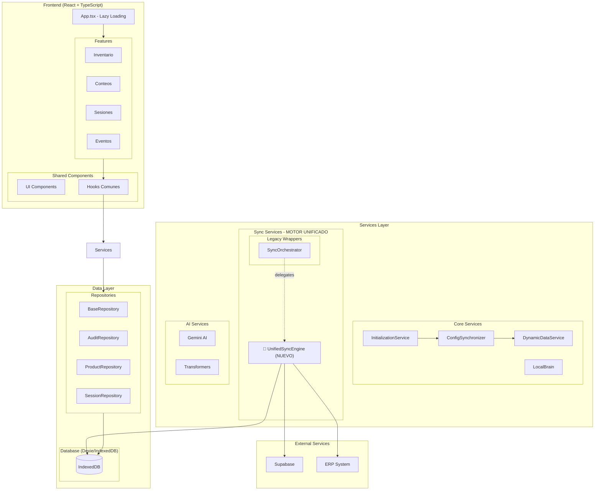
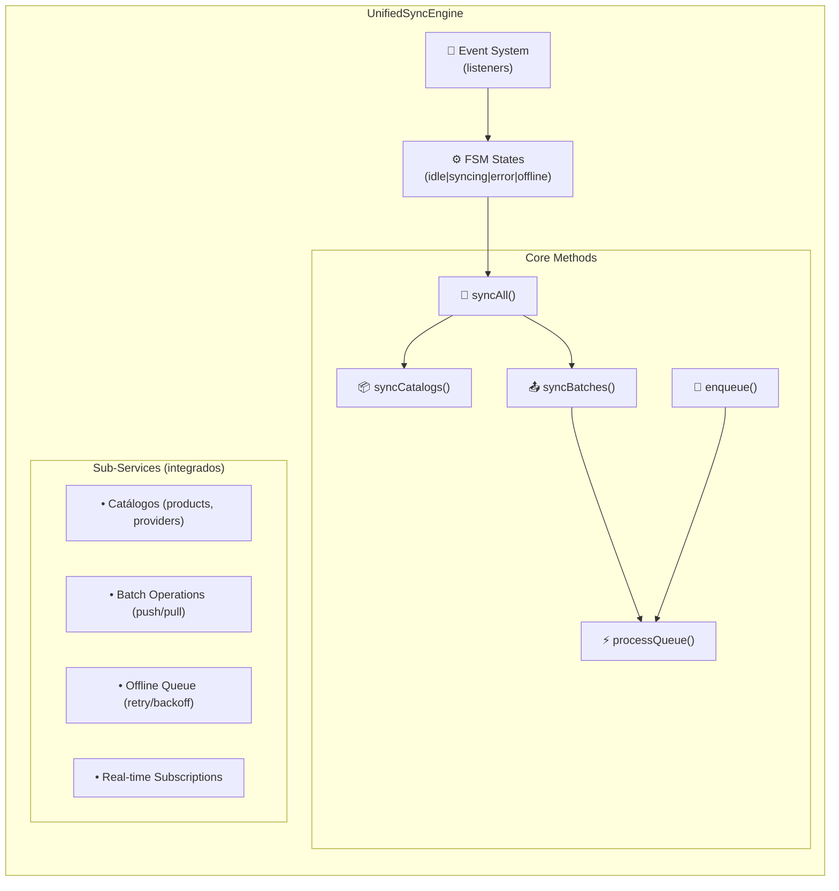
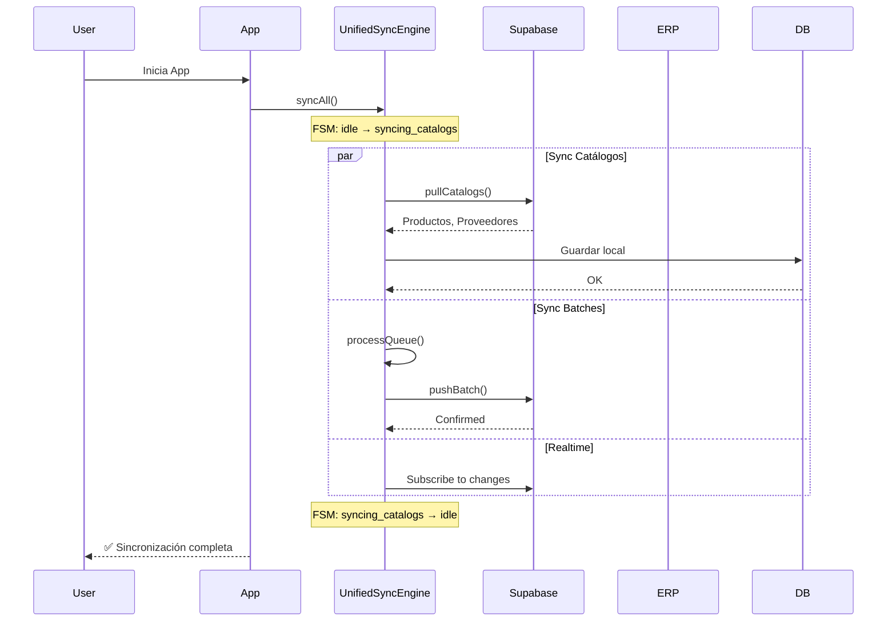
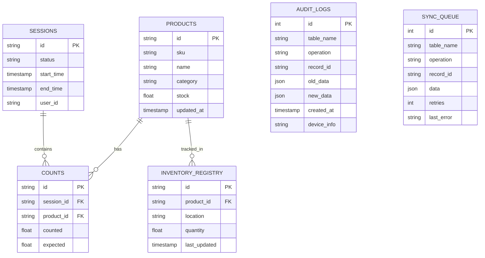
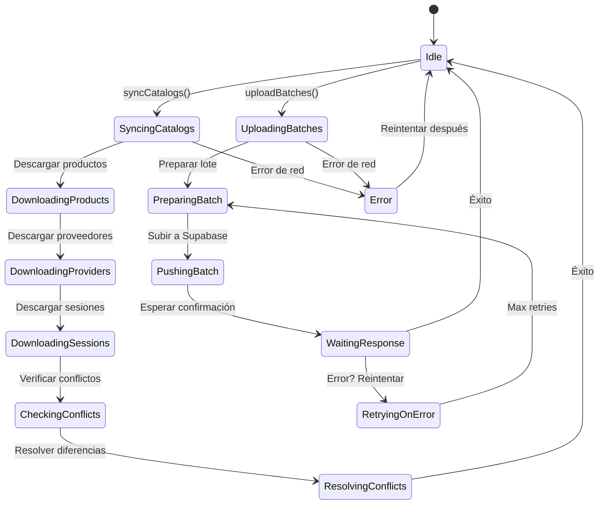
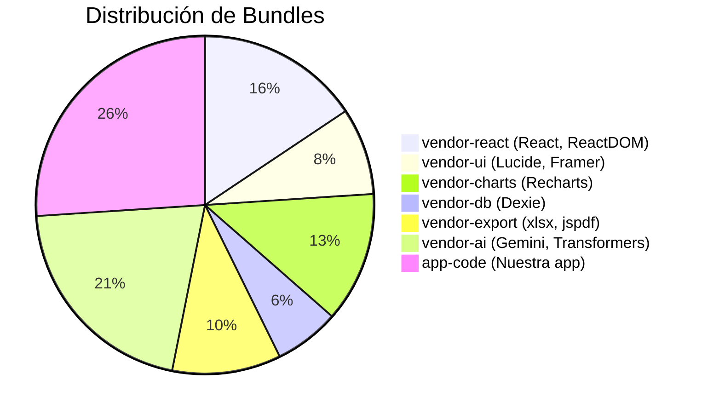

# Arquitectura de ContarStock v2

## Diagrama de Funcionamiento de la Aplicación

```
┌─────────────────────────────────────────────────────────────────────────────┐
│                           CONTARSTOCK v2                                     │
│                    Sistema de Gestión de Inventario                          │
└─────────────────────────────────────────────────────────────────────────────┘

                              ┌─────────────────┐
                              │   NAVEGACIÓN    │
                              │   PRINCIPAL     │
                              └────────┬────────┘
                                       │
        ┌──────────────────────────────┼──────────────────────────────┐
        │                              │                              │
        ▼                              ▼                              ▼
┌───────────────┐            ┌─────────────────┐            ┌─────────────────┐
│   SIDEBAR     │            │  BOTTOM DOCK    │            │   TOP HEADER    │
│   (Desktop)   │            │    (Mobile)     │            │   (Global)      │
└───────────────┘            └─────────────────┘            └─────────────────┘
        │                              │                              │
        └──────────────────────────────┼──────────────────────────────┘
                                       │
                    ┌──────────────────┼──────────────────┐
                    │                  │                  │
                    ▼                  ▼                  ▼
         ┌──────────────────┐  ┌──────────────────┐  ┌──────────────────┐
         │   📊 DASHBOARD   │  │   📦 CAPTURA     │  │   🔄 SINCRONIZ. │
         │   Métricas y     │  │   Conteo de      │  │   Sync con la    │
         │   Resumenes      │  │   Inventario     │  │   nube (PWA)     │
         └──────────────────┘  └──────────────────┘  └──────────────────┘
                    │                  │                  │
                    ▼                  ▼                  ▼
┌─────────────────────────────────────────────────────────────────────────────┐
│                         MÓDULOS DE LA APLICACIÓN                             │
└─────────────────────────────────────────────────────────────────────────────┘

┌─────────────────────────────────────────────────────────────────────────────┐
│                                                                              │
│  ┌─────────────┐  ┌─────────────┐  ┌─────────────┐  ┌─────────────┐        │
│  │   📦📦📦   │  │    👥👥    │  │    🚚🚚    │  │    📋📋    │        │
│  │  INVENTARIO │  │  CLIENTES  │  │ PROVEEDORES│  │ PEDIDOS    │        │
│  │             │  │             │  │             │  │ ESPERADOS  │        │
│  └─────────────┘  └─────────────┘  └─────────────┘  └─────────────┘        │
│                                                                              │
│  ┌─────────────┐  ┌─────────────┐  ┌─────────────┐  ┌─────────────┐        │
│  │    🔨🔨    │  │    📝📝    │  │    📊📊    │  │    🏷️🏷️   │        │
│  │   HAMMER    │  │   SLICES   │  │   REPORTES  │  │ ETIQUETAS  │        │
│  │   PRICE     │  │   AUDITORÍA│  │             │  │             │        │
│  └─────────────┘  └─────────────┘  └─────────────┘  └─────────────┘        │
│                                                                              │
└─────────────────────────────────────────────────────────────────────────────┘

┌─────────────────────────────────────────────────────────────────────────────┐
│                         FLUJO DE DATOS PRINCIPAL                             │
└─────────────────────────────────────────────────────────────────────────────┘

     USUARIO                          APP                              NUBE
       │                               │                                │
       │  1. Escanea Producto          │                                │
       │──────────────────────────────▶│                                │
       │                               │                                │
       │                               │  2. Busca en Local (Dexie)     │
       │                               │──────────────────────────────▶  │
       │                               │                                │
       │                               │  3. Producto Encontrado?       │
       │                               │◀───────────────────────────────│
       │                               │                                │
       │  4. Ingresa Cantidad          │                                │
       │──────────────────────────────▶│                                │
       │                               │                                │
       │                               │  5. Guarda en IndexedDB        │
       │                               │───────────────────────────────▶│
       │                               │                                │
       │  6. Confirma                  │                                │
       │──────────────────────────────▶│                                │
       │                               │                                │
       │                               │  7. Agrega a SyncQueue          │
       │                               │───────────────────────────────▶│
       │                               │                                │
       │                               │  8. SyncManager (Background)    │
       │                               │───────────────────────────────▶│
       │                               │                                │
       │  9. Sincronizado ✓            │                                │
       │◀──────────────────────────────│                                │
       │                               │                                │


┌─────────────────────────────────────────────────────────────────────────────┐
│                         SISTEMA DE DISEÑO (REDISEÑO 2026)                    │
└─────────────────────────────────────────────────────────────────────────────┘

┌─────────────────────────────────────────────────────────────────────────────┐
│                           TEMA OSCURO (Default)                              │
├─────────────────────────────────────────────────────────────────────────────┤
│  Variable CSS          │  Clase Tailwind  │  Valor              │  Uso       │
├─────────────────────────┼──────────────────┼────────────────────┼───────────│
│  --bg-base             │  bg-base         │  #09090b           │  Fondo    │
│  --bg-surface          │  bg-surface      │  #18181b           │  Cards    │
│  --bg-elevated         │  bg-elevated     │  #27272a           │  Elem.Elev│
│  --border-subtle       │  border-subtle   │  rgba(255,5%)      │  Bordes   │
│  --text-primary        │  text-primary    │  #f4f4f5           │  Texto pr │
│  --text-secondary      │  text-secondary  │  #a1a1aa           │  Texto sc │
│  --text-muted          │  text-muted      │  #71717a           │  Texto mt │
│  --color-primary       │  text-primary    │  #3b82f6           │  Acento   │
└─────────────────────────────────────────────────────────────────────────────┘

┌─────────────────────────────────────────────────────────────────────────────┐
│                           MODOS DE OPERACIÓN                                 │
└─────────────────────────────────────────────────────────────────────────────┘

┌─────────────────────────────────────────────────────────────────────────────┐
│  ┌─────────────────┐  ┌─────────────────┐  ┌─────────────────┐            │
│  │   📦 CONTEO     │  │   🔨 HAMMER      │  │   📱 ERP        │            │
│  │                 │  │   PRICE          │  │   MODE          │            │
│  │ Conteo físico   │  │ Modificación     │  │ Lectura simple  │            │
│  │ de inventario   │  │ masiva de        │  │ sin captura     │            │
│  │                 │  │ precios          │  │                 │            │
│  └─────────────────┘  └─────────────────┘  └─────────────────┘            │
└─────────────────────────────────────────────────────────────────────────────┘

## Diagrama General de Componentes



### Arquitectura del Motor Unificado



## Flujo de Sincronización



### API Pública del Motor Unificado

```typescript
// Uso recomendado (código nuevo)
import { unifiedSyncEngine } from '@/services/sync/unified';

// Sincronización completa
await unifiedSyncEngine.syncAll();

// Solo catálogos
await unifiedSyncEngine.syncCatalogs();

// Solo batches pendientes
await unifiedSyncEngine.syncBatches();

// Encolar cambio offline
await unifiedSyncEngine.enqueue({
  tableName: 'products',
  recordId: '123',
  operation: 'update',
  data: { name: 'Nuevo Producto' },
  priority: 'high'
});

// Suscribirse a eventos
unifiedSyncEngine.addListener((event) => {
  console.log('Sync event:', event.type);
});

// Tiempo real
unifiedSyncEngine.startRealtimeSync();
```

### Compatibilidad Legacy

```typescript
// Código existente sigue funcionando
import { syncOrchestrator } from '@/services/sync';

// syncOrchestrator.delegates internally to unifiedSyncEngine
await syncOrchestrator.syncAll();
```

## Modelo de Datos



## Estados de Sync FSM



## TypeScript Strict Mode Status

✅ **TypeScript Strict Mode: HABILITADO - 0 errores**

### Correcciones Realizadas

| Archivo | Corrección |
|---------|------------|
| `AuditRepository.ts` | Agregado null-check para métodos opcionales (saveMany, update, count, exists) |
| `ConfigSynchronizer.ts` | Imports corregidos (CloudStorageConfig, AppSettings) y null-check para cloudConfig |
| `modules.ts` | Path corregido de `../../types` a `../types` |
| `SyncQueueService.ts` | Imports corregidos (telemetryService, handleError) y tipo priority requerido |
| `SyncQueueService.ts` | TelemetryEventType cambiado de 'SYNC_QUEUE' a 'SYNC' |
| `SyncFSM.extended.test.ts` | async callback fix para match con Promise<void> |
| `ProductSearchInput.tsx` | Null-check para supplierRut |
| `useCloudCache.ts` | Generic interface movida fuera de la función |

## Análisis de Motores de Sincronización

La aplicación tiene **3 motores de sync** + **2 orquestadores**:

### Motores Principales
| Motor | Ubicación | Propósito |
|-------|-----------|-----------|
| `GenericSyncEngine` | `src/services/cloud/` | Sync de catálogos (productos, proveedores, sesiones) |
| `BatchSyncService` | `src/services/cloud/` | Operaciones batch: push, pull, delete |
| `RealtimeSyncService` | `src/services/cloud/` | Suscripciones en tiempo real via Supabase |

### Orquestadores
| Orquestador | Ubicación | Propósito |
|-------------|-----------|-----------|
| `SyncOrchestrator` | `src/services/sync/` | Coordina GenericSyncEngine + BatchSyncService |
| `SyncFSM` | `src/services/sync/fsm/` | Máquina de estados para gestión de sync |

### Cola Offline
| Servicio | Ubicación | Propósito |
|----------|-----------|-----------|
| `SyncQueueService` | `src/services/sync/` | Cola offline con retry y backoff exponencial |

### Evaluación: ¿Es Ideal?

**NO, actualmente hay redundancia.** Recomendaciones:

1. **Consolidar a 2 motores máximo**: GenericSyncEngine (catálogos) + BatchSyncService (datos usuario)
2. **Eliminar SyncOrchestrator**: Añade otra capa de indirección
3. **Cola unificada**: Un solo SyncQueueService, no múltiples mecanismos de cola
4. **Centralizar tipos**: Solo `types/common.ts` como fuente única de verdad

**Estado actual**: 3 motores + 2 orquestadores = 5 partes móviles
**Ideal**: 1-2 motores máximo

## Estructura de Bundles (Vite)


