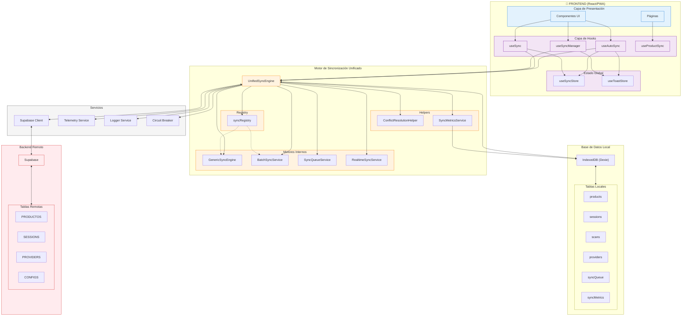
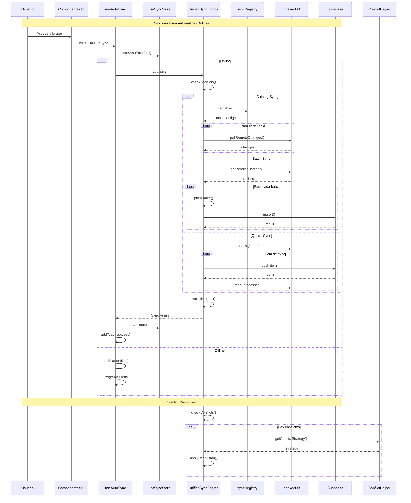
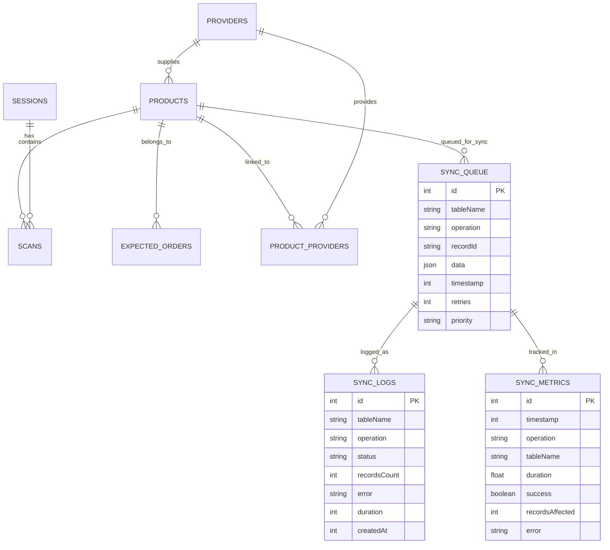
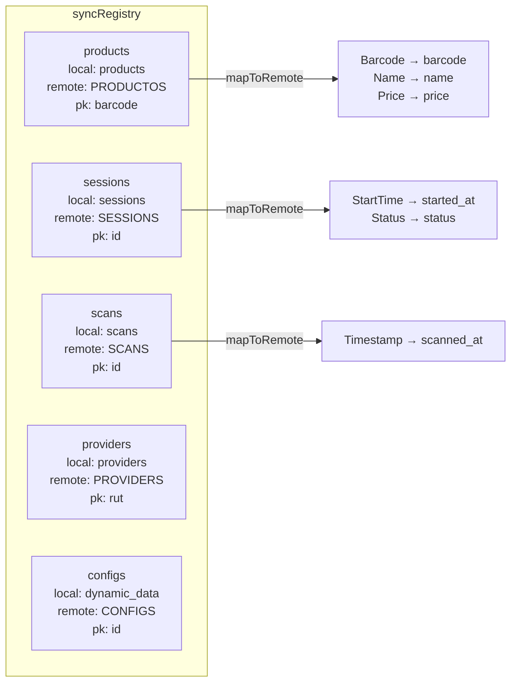
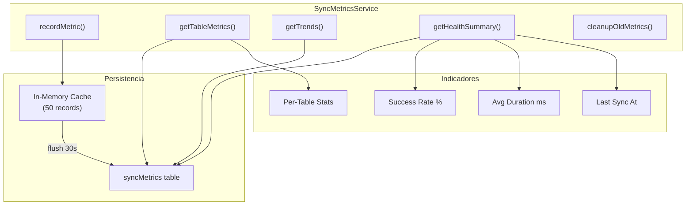
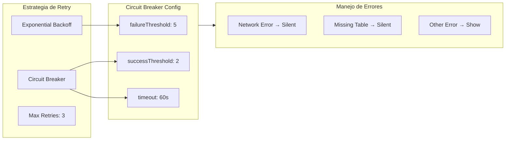

# Arquitectura de Sincronización - ContarStock v2

## Diagrama de Arquitectura General



## Flujo de Sincronización Completo



## Diagrama de Estados (FSM)

```mermaid
stateDiagram-v2
    [*] --> Idle: Init
    
    Idle --> Syncing: triggerSync()
    Idle --> Paused: pause()
    Paused --> Idle: resume()
    
    Syncing --> Syncing: Pull catalogs
    Syncing --> Syncing: Push batches
    Syncing --> Syncing: Process queue
    
    Syncing --> Success: All done
    Syncing --> Error: Any error
    
    Success --> Idle: Complete
    Error --> Idle: Show error
    Error --> Retrying: Auto retry
    
    Retrying --> Syncing: Retry
    Retrying --> Error: Max retries
    
    note right of Syncing
        Circuit Breaker
        puede abrir aquí
    end
    
    note right of Idle
        Timer cada 60s
        revisa pendingItems
    end
```

## Estructura de Datos



## Tablas del Registry



## Métricas de Rendimiento



## Retry & Resilience



## Resumen de Archivos

```
src/services/sync/unified/
├── UnifiedSyncEngine.ts      (800+ líneas) - Motor principal
├── types.ts                  (280+ líneas) - Tipos TypeScript
├── index.ts                  (160+ líneas) - Exports públicos
├── registry.ts               (60+ líneas)  - Registro de tablas
├── ConflictResolutionHelper.ts             - Resolución de conflictos
└── SyncMetricsService.ts                  - Métricas de rendimiento

src/hooks/
├── useAutoSync.ts            - Hook de sync automático
└── (migrado a unifiedSyncEngine)

src/shared/hooks/
└── useSync.ts                - Hook genérico de sync

src/features/sync/hooks/
└── useSyncManager.ts         - Manager de UI de sync
```

## API Pública del UnifiedSyncEngine

```typescript
// Métodos principales
syncAll(): Promise<SyncResult>           // Sincronización completa
syncCatalogs(): Promise<TableSyncResult[]> // Solo catálogos
syncBatches(): Promise<SyncResult>       // Solo batches
syncTable(table: string): Promise<TableSyncResult>

// Cola offline
enqueueSync(item: QueuedSyncItem): Promise<void>
processQueue(): Promise<QueueProcessResult>

// Realtime
startRealtimeSync(): void
stopRealtimeSync(): void

// Métricas y estado
getSyncStats(): Promise<SyncStats>
getSyncState(): SyncState
addSyncListener(listener: SyncEventListener): void

// Helpers
pushBatch(table: string, rows: any[]): Promise<SyncResult>
pullTable(table: string, since?: string): Promise<TableSyncResult>
checkConflicts(table: string): Promise<SyncConflict[]>
```